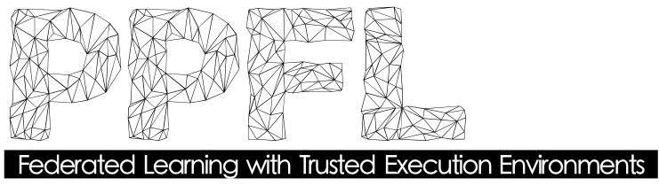

This is an application that runs privacy-preserving federated learning with Trusted Execution Environments. A layer-wise training technique is used for keeping the training layers always inside trusted areas. The application has two parts: 1) the server side with SGX using [OpenEnclave SDK](https://github.com/openenclave/openenclave) for secure aggregation; 2) the client side with TrustZone using [OP-TEE](https://www.op-tee.org/).

---------------------------
Please consider citing the corresponding paper at [MobiSys 2021](https://www.sigmobile.org/mobisys/2021/) if this project is helpful to you:


**[PPFL: Privacy-preserving Federated Learning with Trusted Execution Environments](https://arxiv.org/abs/2104.14380)** Fan Mo, Hamed Haddadi, Kleomenis Katevas, Eduard Marin, Diego Perino, Nicolas Kourtellis


# Prerequisites
To run this application, you will need **one SGX-eabled PC** as the server and **one TrustZone-eabled device** as the client.

Check [this link](https://github.com/ayeks/SGX-hardware) and make sure your PC has SGX.

Check [this link](https://optee.readthedocs.io/en/latest/general/platforms.html#platforms-supported) for TrustZone-eabled devices with OPTEE supports.


# Setup
## (1) Set up Client Side

Follow [client side instruction](client_side_trustzone/README.md). In the end, make sure you can train a model on-device using TrustZone. For example, test it using the command below:

```
darknetp classifier train -pp_start 4 -pp_end 10 cfg/mnist.dataset cfg/mnist_lenet.cfg
```

When everything is ready, you will see output showing that it starts training the model.


## (2) Set up Server Side


### Step 1:

You will need *Ubuntu 18.04* PC and first install Open Enclave SDK for supporting use of SGX. Follow [this instruction](https://github.com/openenclave/openenclave/blob/master/docs/GettingStartedDocs/install_oe_sdk-Ubuntu_18.04.md) to do so.

To test whether you are able to run samples/applications, build samples following [BuildSamplesLinux](https://github.com/openenclave/openenclave/blob/master/samples/BuildSamplesLinux.md), and then try to run the `Hello World` sample.

### Step 2:

First clone the (server-side) codes and compile it using Open Enclave SDK.

```
git clone https://github.com/mofanv/privacy-preserving-federated-learning.git
cd ./privacy-preserving-federated-learning/server_side_sgx/
make build
make run
```

### Step3:

set `IP_CLIENT_1`, `PASSWORD_CLIENT1`, `NUM_ROUNDS`. `NUM_CLIENTS`, `PP_START`, `PP_END`, `DATASET`, `MODEL`, etc in `fl_script/fl_tee*.sh` file. where,

- `IP_CLIENT_1` refers to the IP of the client's device
- `PASSWORD_CLIENT1` refers to the user password of the device
- `NUM_ROUNDS` refers to the number of communication rounds
- `NUM_CLIENTS` refers to the number of clients (note that here we simulate multiple clients using one device)
- `PP_START` and `PP_END` refer to the index of layers inside the TEE
- `DATASET` and `MODEL` refer to the dataset and model being used


### step4:

run `fl_tee*.sh` for FL with TEE protection on training at both server and client side. For example,

```
cd fl_script/
./fl_tee_layerwise.sh
```

- `fl_tee_standard_ss.sh` refers to standard FL with a separate saving of weights (i.e. REE and TEE). As opposed to that, `fl_tee_standard_noss.sh` is saving weights together.
- `fl_tee_transfer_once.sh` refers to transfer learning using FL and the feature extractor is communicated only once.
- `fl_tee_transfer_updates.sh` refers to transfer learning using FL and the feature extractor keeps updating in each communication round.
- `fl_tee_layerwise.sh` refers to greedy layer-wise learning using FL.


*Note that in the worst case you could try to run both sides with simulation, i.e., Open Enclave on PC without SGX and OPTEE in QEMU. However, this is not tested.*


# License
```
MIT License

Copyright (c) 2021 Fan Mo, f.mo18@imperial.ac.uk

Permission is hereby granted, free of charge, to any person obtaining a copy
of this software and associated documentation files (the "Software"), to deal
in the Software without restriction, including without limitation the rights
to use, copy, modify, merge, publish, distribute, sublicense, and/or sell
copies of the Software, and to permit persons to whom the Software is
furnished to do so, subject to the following conditions:

The above copyright notice and this permission notice shall be included in all
copies or substantial portions of the Software.

THE SOFTWARE IS PROVIDED "AS IS", WITHOUT WARRANTY OF ANY KIND, EXPRESS OR
IMPLIED, INCLUDING BUT NOT LIMITED TO THE WARRANTIES OF MERCHANTABILITY,
FITNESS FOR A PARTICULAR PURPOSE AND NONINFRINGEMENT. IN NO EVENT SHALL THE
AUTHORS OR COPYRIGHT HOLDERS BE LIABLE FOR ANY CLAIM, DAMAGES OR OTHER
LIABILITY, WHETHER IN AN ACTION OF CONTRACT, TORT OR OTHERWISE, ARISING FROM,
OUT OF OR IN CONNECTION WITH THE SOFTWARE OR THE USE OR OTHER DEALINGS IN THE
SOFTWARE.
```
